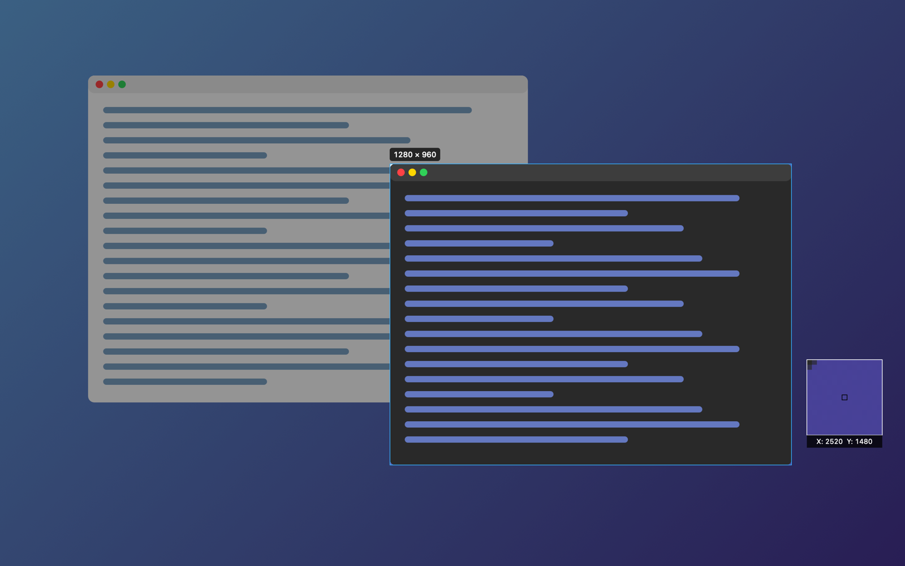
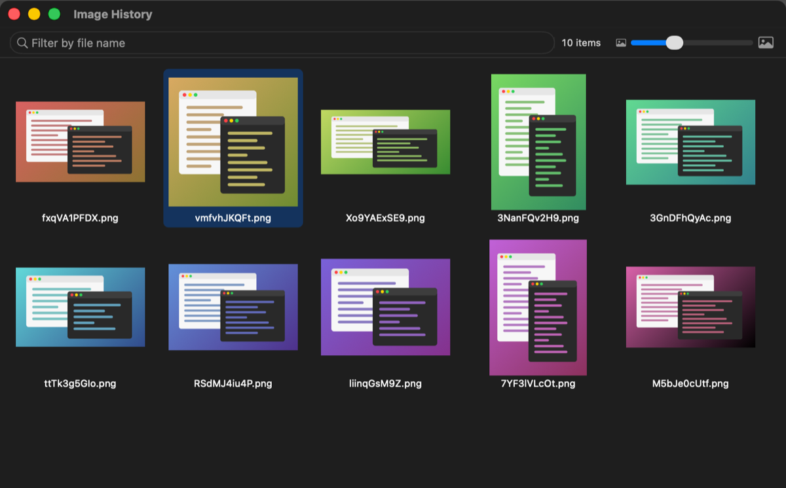

# sharex-mac

[日本語](README.ja.md)

An unofficial macOS menu bar app for screen capture, inspired by [ShareX](https://github.com/ShareX/ShareX). It is written from scratch in Swift and is not affiliated with or endorsed by the ShareX Team.





## Features

- Region capture on a frozen screen, with window detection, a magnifier, and pixel size display
- Active window capture without the window shadow
- Fullscreen capture of the display under the mouse pointer
- After-capture tasks: save to file, copy to clipboard, show a notification, play a sound
- Image history window with thumbnails, file name filter, and a context menu (open, show in Finder, copy, move to trash)
- Launch at login
- English and Japanese UI

## Requirements

- macOS 14 or later
- Xcode or the Xcode Command Line Tools (Swift 5.10 or later)

## Build and install

```sh
git clone https://github.com/sofuetakuma112/sharex-mac.git
cd sharex-mac
./build.sh --install
```

This installs `~/Applications/sharex-mac.app`. On first launch, allow sharex-mac in System Settings > Privacy & Security > Screen & System Audio Recording, then restart the app.

`./build.sh` without `--install` only builds `build.noindex/sharex-mac.app`. Run the tests with `swift test`.

## Hotkeys

| Action | Hotkey |
|---|---|
| Region capture | ⌃⌥⇧4 (Control + Option + Shift + 4) |
| Window capture | ⌃⌥⇧5 |
| Fullscreen capture | ⌃⌥⇧3 |

In region capture, drag to select an area or click a window to capture it. Press Return to capture the whole display, and Esc or right-click to cancel.

## Save location

Captures are saved to `~/Pictures/sharex-mac/` as 10-character random file names. To change the folder:

```sh
defaults write io.github.sofuetakuma112.sharex-mac screenshotsFolder ~/Desktop/Captures
```

## Known limitations

- Hotkeys cannot be customized yet.
- Fullscreen capture covers only the display under the mouse pointer, not all displays combined.
- There are no signed or notarized binaries; build from source.
- The build is ad-hoc signed, so macOS treats each rebuild as a new app and the Screen Recording permission must be granted again. Set `SIGN_IDENTITY` to a code signing identity to avoid this: `SIGN_IDENTITY="My Certificate" ./build.sh --install`.
- ShareX features such as the annotation editor, uploaders, and screen recording are not implemented.

## License

Copyright (C) 2026 Sofue Takuma

This program is free software licensed under the [GNU General Public License v3.0](LICENSE).

`Resources/CaptureSound.wav` and `Resources/TaskCompletedSound.wav` are taken from [ShareX](https://github.com/ShareX/ShareX), Copyright (c) 2007-2026 ShareX Team, licensed under GPL-3.0.
